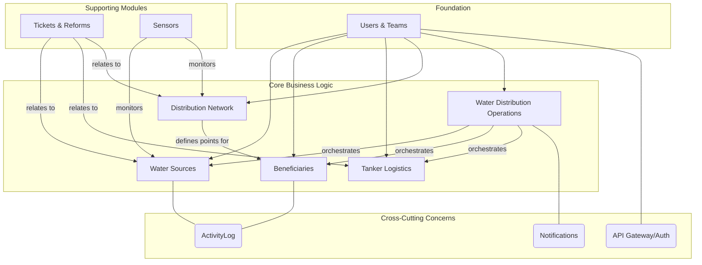

# LifeBlood: Water Management & Humanitarian Logistics System

[](https://php.net/)
[](https://laravel.com)
[](https://opensource.org/licenses/MIT)

<details>
<summary><strong>English</strong></summary>

**LifeBlood** is an advanced logistical information system designed for managing water operations in humanitarian contexts. The system is engineered as an API-driven backend platform, built using the Laravel framework with a strict adherence to a Modular Architecture.

The system covers the entire operational lifecycle: starting from user and team management, through identifying and assessing water sources, registering beneficiaries and their quotas, managing distribution networks and tanker assets, planning and executing distribution routes, and concluding with the management of maintenance tickets and repairs.

</details>

<details>
<summary><strong>العربية</strong></summary>

**LifeBlood** هو نظام معلومات لوجستي متقدم مصمم لإدارة عمليات المياه في السياقات الإنسانية. تم تصميم النظام كمنصة خلفية (Backend) قائمة على واجهة برمجة التطبيقات (API)، وهو مبني باستخدام إطار عمل Laravel مع تطبيق صارم للبنية المعيارية (Modular Architecture).

يغطي النظام دورة العمل الكاملة: بدءًا من إدارة المستخدمين والفرق، مرورًا بتحديد مصادر المياه وتقييم جودتها، وتسجيل المستفيدين وتحديد حصصهم، وإدارة شبكات التوزيع وأصول الصهاريج، وتخطيط وتنفيذ مسارات التوزيع، وانتهاءً بإدارة تذاكر الصيانة والإصلاحات.

</details>

---

## ✨ Key Features & Technologies

<details>
<summary><strong>English</strong></summary>

The project leverages a suite of advanced technologies and concepts to ensure robustness, security, and maintainability:

- **Modular Architecture (`nwidart/laravel-modules`)**: Systematically divided into independent and interconnected Business Units, facilitating independent development and maintenance.
- **Role-Based Access Control (`spatie/laravel-permission`)**: A granular permissions system ensuring that each user can only access authorized functions and data.
- **Multilingual Support (`spatie/laravel-translatable`)**: Full support for multiple languages (e.g., Arabic, English, French) for both API responses and data.
- **Geospatial Data Processing (`matanyadaev/laravel-eloquent-spatial`)**: Efficiently stores and processes geospatial data (Points, LineStrings) for locations and routes.
- **Secure Authentication (`laravel/sanctum`)**: Secure, token-based API authentication system.
- **Comprehensive Logging (`spatie/laravel-activitylog`)**: Detailed logging of all significant system activities for audit and security purposes.
- **Service & Repository Layers**: Decoupling of business logic from data access logic to create clean, maintainable code.
- **Background Job Processing**: Utilizes Queues to process long-running tasks (like sending reports and notifications) in the background without impacting API performance.

</details>

<details>
<summary><strong>العربية</strong></summary>

يستفيد المشروع من مجموعة من التقنيات والمفاهيم المتقدمة لضمان القوة والأمان وقابلية الصيانة:

- **Modular Architecture (`nwidart/laravel-modules`)**: تقسيم النظام إلى وحدات أعمال (Business Units) مستقلة ومترابطة، مما يسهل التطوير المستقل والصيانة.
- **Role-Based Access Control (`spatie/laravel-permission`)**: نظام صلاحيات دقيق يضمن أن كل مستخدم يمكنه الوصول فقط إلى الوظائف والبيانات المصرح له بها.
- **Multilingual Support (`spatie/laravel-translatable`)**: دعم كامل للغات متعددة (عربي، إنجليزي، فرنسي، إلخ) للاستجابات والبيانات.
- **Geospatial Data Processing (`matanyadaev/laravel-eloquent-spatial`)**: تخزين ومعالجة البيانات الجغرافية المكانية بكفاءة (نقاط، خطوط) للمواقع والمسارات.
- **Secure Authentication (`laravel/sanctum`)**: نظام مصادقة API آمن قائم على التوكن (Token).
- **Comprehensive Logging (`spatie/laravel-activitylog`)**: تسجيل مفصل لجميع الأنشطة الهامة في النظام لأغراض التدقيق والأمان.
- **Service & Repository Layers**: فصل منطق العمل ومنطق الوصول إلى البيانات لإنشاء كود نظيف وقابل للصيانة.
- **Background Job Processing**: استخدام قوائم الانتظار (Queues) لمعالجة المهام الطويلة في الخلفية (مثل إرسال التقارير والإشعارات) دون التأثير على أداء الـ API.

</details>

---

## 🚀 Installation and Setup

### Prerequisites
Ensure you have the following installed on your machine:
- **PHP** (>= 8.1)
- **Composer**
- **MySQL** or another compatible database
- **Web Server** (e.g., Apache via XAMPP, Nginx)
- **API Client** (e.g., Postman) for testing the endpoints.

### Setup Steps

1.  **Clone the repository**:
    ```bash
    git clone [https://github.com/NevinRashid/lifeblood_water_management](https://github.com/NevinRashid/lifeblood_water_management)
    cd lifeblood_water_management
    ```

2.  **Install dependencies**:
    ```bash
    composer install
    ```

3.  **Setup environment file `.env`**:
    ```bash
    cp .env.example .env
    ```
    *Afterward, configure your database settings in the `.env` file.*
    *(بعد ذلك، قم بتكوين إعدادات قاعدة البيانات الخاصة بك في ملف `.env`.)*

4.  **Generate application key**:
    ```bash
    php artisan key:generate
    ```

5.  **Run database migrations**:
    *This is a critical step that will create all ~25 tables for the application and its modules.*
    *(هذه خطوة حاسمة ستقوم بإنشاء جميع جداول التطبيق ووحداته (حوالي 25 جدولًا).)*
    ```bash
    php artisan migrate
    ```

6.  **Run database seeders**:
    *This will populate the database with essential data like permissions, roles, and an admin user.*
    *(سيقوم هذا الأمر بملء قاعدة البيانات بالبيانات الأساسية مثل الصلاحيات والأدوار ومستخدم مسؤول.)*
    ```bash
    php artisan db:seed
    ```
    >**Default Admin Credentials**: Check `Modules/UsersAndTeams/Database/Seeders/` for details. The default password is `password`.

7.  **Start the application**:
    ```bash
    php artisan serve
    ```

8.  **Run the queue worker** (in a separate terminal):
    *This is necessary for processing background jobs like notifications.*
    *(هذا ضروري لمعالجة المهام في الخلفية مثل الإشعارات.)*
    ```bash
    php artisan queue:work
    ```

9.  **Interact with the API**:
    Use Postman to test the various endpoints. Get the collection from [here](https://documenter.getpostman.com/view/33882685/2sB2qgeJiD).

---

## 🏗️ Core Architectural Principles

<details>
<summary><strong>English</strong></summary>

The system is built upon a set of core principles that guide every aspect of development:

- **Separation of Concerns (SoC)**: This principle is applied at multiple levels: separating the system into Modules, and within each module, separating the presentation layer (Controllers/Resources), business logic (Services), and data access (Models).
- **Don't Repeat Yourself (DRY)**: Code duplication is avoided through the use of `BaseService` classes, Traits, and centralized error handling.
- **Dependency Injection (DI)**: Services are injected into controllers, which facilitates component swapping and greatly simplifies testing.
- **API-First Design**: The system was designed as an API service from the ground up, with a focus on structured JSON responses, accurate HTTP status codes, and multilingual support.

</details>

<details>
<summary><strong>العربية</strong></summary>

تم بناء النظام على مجموعة من المبادئ الأساسية التي توجه كل جانب من جوانب التطوير:

- **Separation of Concerns (SoC)**: يتم تطبيق هذا المبدأ على عدة مستويات: فصل النظام إلى وحدات (Modules)، وداخل كل وحدة فصل طبقات العرض (Controllers/Resources)، منطق العمل (Services)، والوصول إلى البيانات (Models).
- **Don't Repeat Yourself (DRY)**: يتم تجنب تكرار الكود من خلال استخدام فئات `BaseService`، والـ `Traits`، ومركزية معالجة الأخطاء.
- **Dependency Injection (DI)**: يتم حقن الخدمات في وحدات التحكم، مما يسهل استبدال المكونات ويسهل الاختبار بشكل كبير.
- **API-First Design**: تم تصميم النظام ليكون خدمة API منذ البداية، مع التركيز على استجابات JSON المنظمة، رموز حالة HTTP الدقيقة، ودعم تعدد اللغات.

</details>

### Deep Dive into the Modular Architecture

<details>
<summary><strong>English</strong></summary>

The system is not just a monolithic Laravel application; it's a collection of mini-applications (modules) that work in harmony. Each module has its own responsibilities and interacts with other modules through defined interfaces (Services/Events).

</details>

<details>
<summary><strong>العربية</strong></summary>

النظام ليس مجرد تطبيق Laravel متجانس؛ إنه مجموعة من التطبيقات الصغيرة (الوحدات) التي تعمل بتناغم. كل وحدة لها مسؤولياتها الخاصة وتتفاعل مع الوحدات الأخرى عبر واجهات محددة (Services/Events).

</details>



- **WaterDistributionOperations (Orchestration Layer)**: This is the central module that orchestrates all other modules to execute the distribution process. It is the "mastermind" of the operations. / *هي الوحدة المركزية التي تنسق بين جميع الوحدات الأخرى لتنفيذ عملية التوزيع. هي "العقل المدبر" للعمليات.*

### Design Patterns in Action

<details>
<summary><strong>English</strong></summary>

- **Service Layer Pattern**: Complex business logic resides in service classes (e.g., `DeliveryRouteService.php`) to decouple it from controllers.
- **Observer Pattern**: Uses Events and Listeners (e.g., `WaterSourceCreated` & `LogWaterSourceCreation`) to decouple secondary actions from primary ones.
- **Decorator Pattern (via Traits)**: Uses Traits like `AutoTranslatesAttributes` to "decorate" models with additional functionality without altering their original code.

</details>

<details>
<summary><strong>العربية</strong></summary>

-   **Service Layer Pattern**: منطق العمل المعقد موجود في فئات الخدمات (e.g., `DeliveryRouteService.php`) لفصله عن وحدات التحكم.
-   **Observer Pattern**: استخدام Events و Listeners (e.g., `WaterSourceCreated` & `LogWaterSourceCreation`) لفصل الإجراءات الثانوية عن الإجراءات الأساسية.
-   **Decorator Pattern (via Traits)**: استخدام Traits مثل `AutoTranslatesAttributes` لـ "تزيين" النماذج بوظائف إضافية دون تعديل كودها الأصلي.

</details>

---

## 📋 Software Requirements Specification (SRS)

### User Scenarios & API Workflows

<details>
<summary><strong>English</strong></summary>

- **Initial Setup (Admin)**: The admin logs in, creates user accounts, and assigns roles and permissions.
- **Water Source Management (Water Quality Analyst)**: The analyst creates a water source and records quality test results. Upon a failed test, the system automatically sends a notification.
- **Beneficiary Management (Field Coordinator)**: The coordinator registers beneficiaries and links them to distribution points.
- **Distribution Planning (Field Coordinator)**: The coordinator creates a delivery route, assigns a driver and tanker, draws the geographic path, and allocates water quotas.
- **Distribution Execution (Tanker Driver)**: The driver views their route and updates the delivery status for beneficiaries.

</details>

<details>
<summary><strong>العربية</strong></summary>

- **الإعداد الأولي (Admin)**: يقوم المسؤول بتسجيل الدخول، إنشاء حسابات المستخدمين، وتعيين الأدوار والصلاحيات.
- **إدارة مصادر المياه (Water Quality Analyst)**: يقوم المحلل بإنشاء مصدر مياه، ويسجل نتائج اختبار الجودة. عند فشل الاختبار، يقوم النظام تلقائيًا بإرسال إشعار.
- **إدارة المستفيدين (Field Coordinator)**: يقوم المنسق بتسجيل المستفيدين وربطهم بنقاط التوزيع.
- **تخطيط عملية التوزيع (Field Coordinator)**: يقوم المنسق بإنشاء مسار توزيع، يحدد السائق والصهريج، يرسم المسار الجغرافي، ويخصص حصص المياه.
- **تنفيذ التوزيع (Tanker Driver)**: يقوم السائق بعرض مساره وتحديث حالة التسليم للمستفيدين.

</details>

### Functional Requirements (FR)

<details>
<summary><strong>English</strong></summary>

-   **FR1 (Users & Teams)**: The system must provide secure authentication, and management of users, roles, and permissions.
-   **FR2 (Water Sources)**: Must allow management of water sources, their parameters, and recording of quality tests with automated notifications.
-   **FR3 (Beneficiaries)**: Must allow management of beneficiary data and their allocated water quotas.
-   **FR4 (Distribution Operations)**: The system must allow planning of geographic distribution routes, tracking their status, and linking them to assets and beneficiaries.
-   **FR5 (Tickets and Reforms)**: Users must be able to create tickets for malfunctions and track their resolution.

</details>

<details>
<summary><strong>العربية</strong></summary>

-   **FR1 (Users & Teams)**: يجب أن يوفر النظام مصادقة آمنة، وإدارة للمستخدمين والأدوار والصلاحيات.
-   **FR2 (Water Sources)**: يجب السماح بإدارة مصادر المياه، معاييرها، وتسجيل اختبارات الجودة مع إشعارات آلية.
-   **FR3 (Beneficiaries)**: يجب السماح بإدارة بيانات المستفيدين وحصص المياه المخصصة لهم.
-   **FR4 (Distribution Operations)**: يجب أن يسمح النظام بتخطيط مسارات التوزيع الجغرافية، وتتبع حالتها، وربطها بالأصول والمستفيدين.
-   **FR5 (Tickets and Reforms)**: يجب أن يتمكن المستخدمون من إنشاء تذاكر للأعطال وتتبع حلها.

</details>

### Non-Functional Requirements (NFR)

<details>
<summary><strong>English</strong></summary>

-   **NFR1 (Security)**: All API endpoints must adhere to security principles, including permission checks at the action level.
-   **NFR2 (Performance)**: Caching should be used for data that does not change frequently to improve performance.
-   **NFR3 (Maintainability)**: The code must adhere to SOLID principles and modular design to facilitate maintenance.
-   **NFR4 (Reliability)**: The system must operate reliably and handle errors gracefully (e.g., using Jobs for background processing).

</details>

<details>
<summary><strong>العربية</strong></summary>

-   **NFR1 (Security)**: يجب أن تتبع جميع واجهات API مبادئ الأمان، بما في ذلك التحقق من الصلاحيات على مستوى كل إجراء.
-   **NFR2 (Performance)**: يجب استخدام التخزين المؤقت (Caching) للبيانات التي لا تتغير بشكل متكرر لتحسين الأداء.
-   **NFR3 (Maintainability)**: يجب أن يلتزم الكود بمبادئ SOLID والتصميم المعياري لتسهيل الصيانة.
-   **NFR4 (Reliability)**: يجب أن يعمل النظام بشكل موثوق وأن يتعامل مع الأخطاء برشاقة (e.g., استخدام Jobs للمعالجة في الخلفية).

</details>

---

## 🗃️ Database Schema Overview

<details>
<summary><strong>English</strong></summary>
Below is a high-level overview of the most important database tables, categorized by function.
</details>
<details>
<summary><strong>العربية</strong></summary>
فيما يلي نظرة عامة على أهم جداول قاعدة البيانات، مقسمة حسب الوظيفة.
</details>

- **Core Application & Cross-Cutting**: `cache`, `jobs`, `sessions`, `media`, `notifications`, `activity_log`, `telescope_...`
- **Users & Permissions**: `users`, `roles`, `permissions`, `model_has_roles`, `model_has_permissions`, `role_has_permissions`
- **Water Sources & Quality**: `water_sources` (location `Point`), `water_source_parameters`, `water_quality_tests`
- **Network & Beneficiaries**: `distribution_networks`, `distribution_points`, `beneficiaries` (location `Point`), `water_quotas`
- **Logistics & Operations**: `tankers`, `user_tankers`, `delivery_routes` (path `LineString`)
- **Maintenance & Sensors**: `tickets`, `reforms`, `sensors`, `sensor_readings`

---

## 🌍 Multilingual API Usage

<details>
<summary><strong>English</strong></summary>
To leverage the multilingual support, include the `Accept-Language` header in your API requests.
</details>
<details>
<summary><strong>العربية</strong></summary>
للاستفادة من دعم تعدد اللغات، قم بتضمين ترويسة `Accept-Language` في طلباتك إلى الـ API.
</details>


| `Accept-Language` Header | Language          |
| ------------------------ | ----------------- |
| `ar`                     | Arabic (العربية)  |
| `en`                     | English           |
| `fr`                     | French (Français) |
| `ru`                     | Russian (Русский) |
| `zh_CN`                  | Chinese (中文)    |

A `SetLocaleLang` middleware will automatically set the application's locale, affecting validation messages and translated texts in API responses. / سيقوم ميدل وير `SetLocaleLang` تلقائيًا بتعيين لغة التطبيق، مما يؤثر على رسائل التحقق من الصحة والنصوص المترجمة في استجابات الـ API.

---

## 📜 License

The Laravel framework is open-sourced software licensed under the [MIT license](https://opensource.org/licenses/MIT).